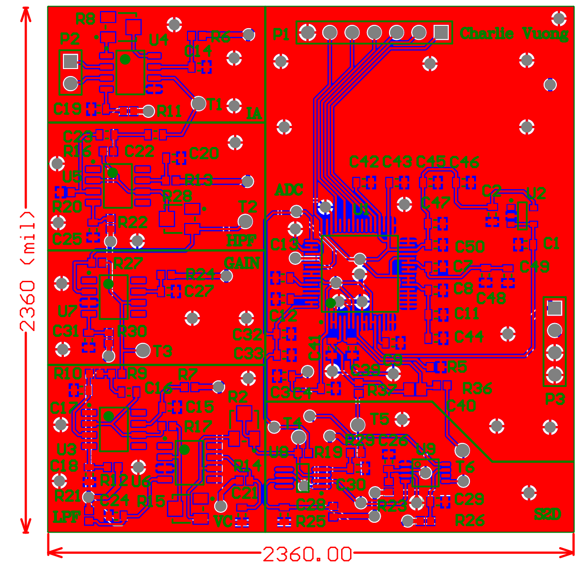
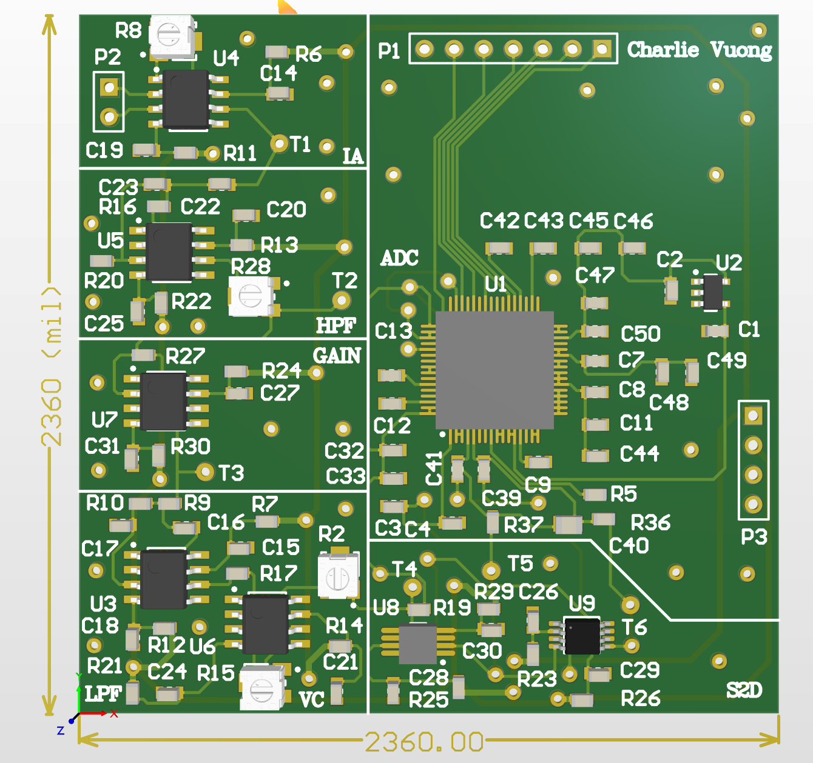

# MAGICOIL 

The current EE design in regards to the "Magicoil" device consists of four elements: Power, Micro-controller, Signal Generation, and Lock-In/ADC. The Micro-controller is used to control signal generation, receive the return signal from the pick-up coils and communicate with external applications (Android App, PC). The lock-In amplier is for picking up that return signal, and can be modeled as a very tight band-pass lter followed by a very high gain amplier, and is typically used for applications where we are searching for very tiny signals (which is the goal here!).

## Specification:

1) 16-bits ADS1675
2) PIC32MZ microcontroller using SPI protocol
3) LPF and HPF
4) Instrumentation amplifier
5) Voltage clipper
6) Power (-5V, +5V)
* Development software: Altium Ver 17.1

### PCB View

### 3D view

From MagiCoil Team at University of Minnesota - Twin Cities - https://magicoil.ece.umn.edu/

Wang, J.-P.; Wu, K.; Vuong, H.; et al. Magnetic Particle Spectroscopy-Based Handheld Device for Wash-Free, 
Easy-to-Use, and Solution-Phase Immunoassay Applications. DMD2020-9054, V001T10A011; 6 Apr. 202
